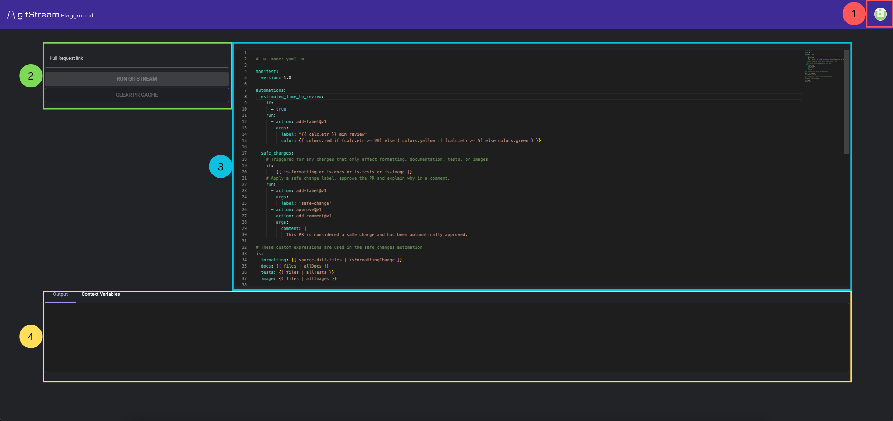

Welcome to gitStream Playground! This platform allows you to thoroughly test gitStream automations before deploying them into the `.cm` rule file on any GitHub pull request of your choice. 
## Getting Started

### Accessing gitStream Playground

To access gitStream Playground, visit [https://app.gitstream.cm/playground](https://app.gitstream.cm/playground). 
To be able to test automations of private repository PRs, log in with your GitHub account credentials.
### Interface Overview

The gitStream Playground interface consists of the following sections:

1. <a  href="ff5757"> Login \ User icon: </a> supports  the following actions
	- Login
	- Logout
	- View user
	- Change organization
2. <a href="7ed957">Pull Request Link:</a> An input textbox for a link to the pull request
3. <a href="0cc0df">cm editor: </a> Code input box where you can write automations to be executed by the playground.  `estimated_time_to_review` and `safe_changes` are provided by default.
4. <a href="ffde59">Output section</a>, with the following tabs:
	- `Output` - shows syntax errors when the `.cm` automation syntax is wrong. After running gitStream - it shows the expected result of the automation on the chosen Pull Request.
	- `Context Variables` - Shows the values of all [Context variables](/context-variables) of the chosen Pull Request.
## Testing Automations

### Selecting a Pull Request
On GitHub, navigate to any pull request, copy its link, and paste it onto the "Pull request link" box. If the PR is part of a private repo, you must also log in to the playground with a GitHub user accessible to this repository.

### Running gitStream

1. Add the desired automations to the editor. Make sure there are no syntax errors
2. Click "Run gitStream."
3. The rule engine loads the PR and runs the automations defined in the `.cm` editor.
### Viewing Results

The automation results will be shown in the "Output" tab at the bottom of the interface. Context Variables will be shown in the "Context Variables" tab.

## Feedback and Support

For additional assistance or to provide feedback, please open an issue on our [GitHub issues page](https://github.com/linear-b/gitstream/issues)