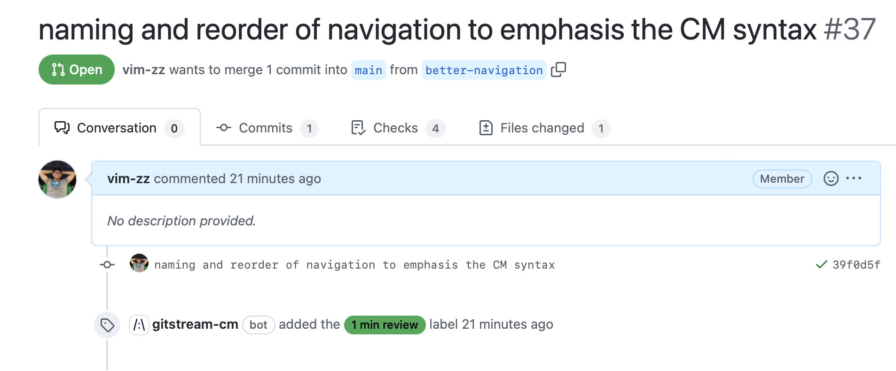

# Quick Start

## First automation – adding labels

Once completed installation, each of your PRs will get a label that shows the estimated review time, with color coding as you define in the `cm` file.

Try it yourself! Open a PR with minor change to the repository `README.md` file, you don't have to merge these changes. Once your PR is open, wait for gitStream check to finish, then your PR should get a colored labeled with `1 min review` label.



When sharing the PR link in Slack, your reviewer will get to see the Estimated Review Time: 


## Marking safe changes

Next, let's add a new automation that checks for `safe-changes`. In the example below, we have defined documentation changes as safe changes. 

!!! note

    When editing the CM file, make sure to preserve the indentation in the examples, as CM like YAML uses Python-style indentation to indicate nesting.

You can copy the text below and overwrite the default `.cm/gitstream.cm` file content. Note the new automation rule `safe_changes`.

```yaml+jinja hl_lines="16"
# -*- mode: yaml -*-

manifest:
  version: 1.0

automations:
  estimated_time_to_review:
    if:
      - true
    run:
      - action: add-label@v1
        args:
          label: "{{ calc.etr }} min review"
          color: {{ 'E94637' if (calc.etr >= 20) else ('FBBD10' if (calc.etr >= 5) else '36A853') }}

  safe_changes:
    if:
      - {{ files | allDocs }}
    run: 
      - action: add-label@v1
        args:
          label: 'safe-changes'
      # You can uncomment the following action to get gitStream to automatically approve 
      # - action: approve@v1

calc:
  etr: {{ branch | estimatedReviewTime }}
```

Try it yourself! Open a PR with some minor change to the repository's `README.md` file, you don't have to merge these changes. Once your PR is open and gitStream check has finished running, you should notice that gitStream added `cm-changes` label and all the automation results are now displayed as new comment in the PR. 

!!! note 

    You can learn more about[dry-run mode here](/dry-run-mode), but the gist of it is that gitStream switch to simulation mode to allow you a safe place to check and test new rules before you merge them to the main branch.

If you didn't get any syntax error, you should see the dry-run comment. Once you ready to update the autaomtion rules with the latest changes, undo the `README.md` file changes, and commit and merge the changes you did to the `.cm/gitstream.cm` file in order for these changes to take effect.

Once again, let's open a new PR with some minor change to the repository's `README.md` file, you don't have to merge these changes. After gitStream check has finished you should see the green labeled with `1 min review` label and – as you only changed a document – the `safe-changes` label will appear on the PR as well.

## Approving safe changes

To approve `safe-changes` you should use the last PR, and uncomment the `- action: approve@v1` (make sure to align the `-` list indicator of the action with the previous one) or just overwrite the `.cm/gitstream.cm` file with this content:

```yaml+jinja hl_lines="24"
# -*- mode: yaml -*-

manifest:
  version: 1.0

automations:
  estimated_time_to_review:
    if:
      - true
    run:
      - action: add-label@v1
        args:
          label: "{{ calc.etr }} min review"
          color: {{ 'E94637' if (calc.etr >= 20) else ('FBBD10' if (calc.etr >= 5) else '36A853') }}

  safe_changes:
    if:
      - {{ files | allDocs }}
    run: 
      - action: add-label@v1
        args:
          label: 'safe-changes'
      # You can uncomment the following action to get gitStream to automatically approve 
      - action: approve@v1

calc:
  etr: {{ branch | estimatedReviewTime }}
```

Again, gitStream will switch to dry-run mode, and you are up for it, just merge the changes to `.cm/gitstream.cm` to get safe changes approved by gitStream for your team. 

Well done! From now on, safe changes won't require developer's time to review and approve them.


## What's next

Once you get the hang of it, you can set up more automation rules. 

You can explore the gitStream [CM syntax](/cm-syntax), or go over the [examples](/examples) page, there you can choose various automation such as marking PRs with no tests, assigning the right reviewer – for example changes to the Japanese translation files can be automatically assigned to the right translator…

Download automation files and add them to your repository `.cm/` directory, experiment in dry-run mode, add labels and then switch to automatic actions.

!!! tip

	The `.cm` directory is located in the repository root and contains the automation files. Multiple rules files are supported.

This is only the beginning. With gitStream, you can create rules to automate your PRs. You understand what your team needs, and gitStream will help you get there.

## Something missing?

If something is missing, create a new enhancement request in the [project's issues page](https://github.com/linear-b/gitstream/issues).
